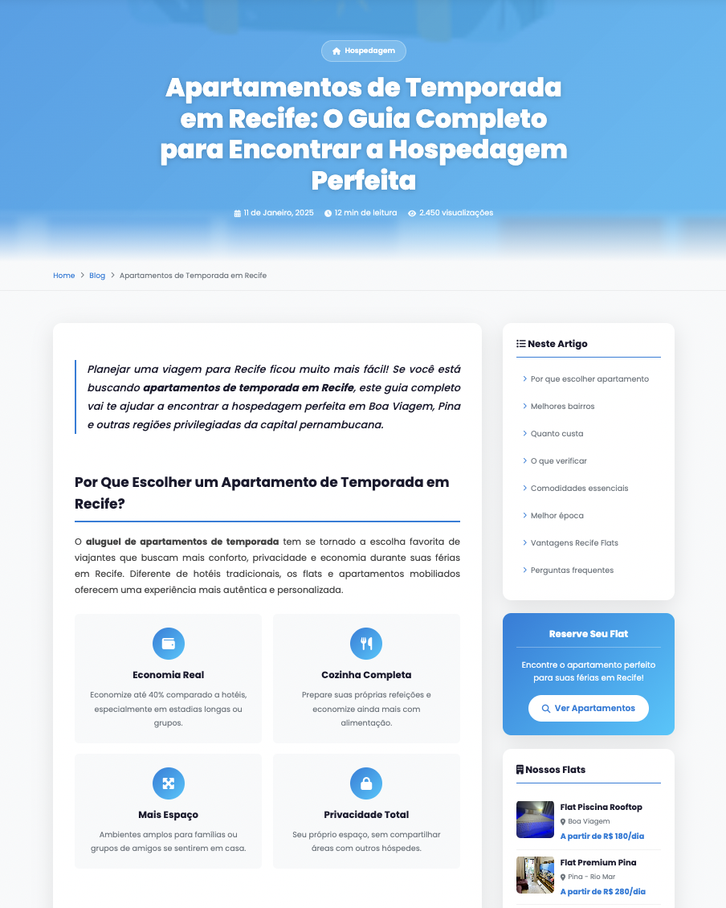
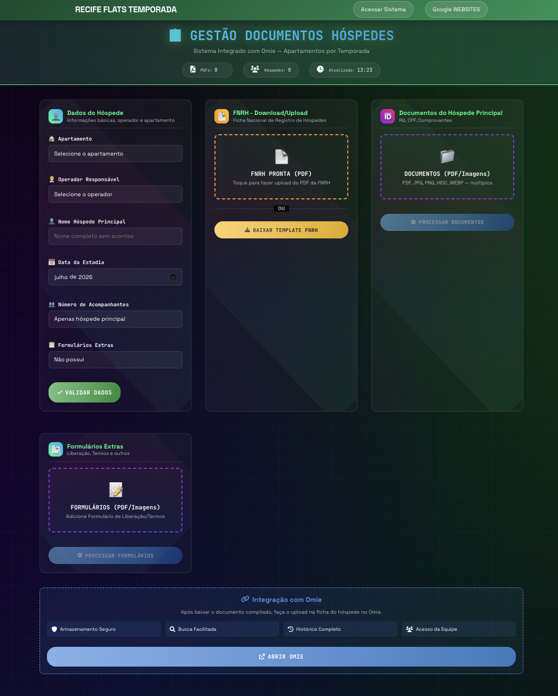

# Recife Flats — Pages

Coleção de páginas estáticas do projeto **Recife Flats**.

---

## 1. Página de Obrigado VIP

Página de agradecimento exibida após o cliente se cadastrar na lista de **Clientes VIP** (página de leads).

**Arquivo:** [01-obrigado-vip.html](01-obrigado-vip.html)

---

## 2. Modelo de Página de Blog

Modelo base completo de página de blog para os apartamentos de temporada. Serve como referência de estrutura, layout e organização de conteúdo.

**Arquivo:** [02-blog-apartamentos-temporada-recife.html](02-blog-apartamentos-temporada-recife.html)

---

## 3. Documento Compilado

Página responsável por gerar um documento único em PDF. Ela reúne automaticamente identidade, CPF, formulário e demais arquivos baixados pelo usuário na aplicação, compilando tudo em um único arquivo organizado.

**Arquivo:** [03-documento-copilado.html](03-documento-copilado.html)
